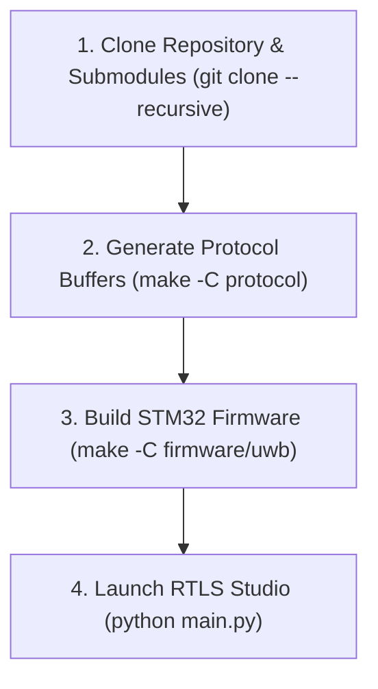

# Getting Started & Environment Setup Guide

[Documentation Home](README.md) · [Firmware Architecture](firmware/architecture.md) · [Deployment Guide](deployment.md)

This guide provides step-by-step instructions for configuring build toolchains, compiling firmware binaries, and launching desktop software for the **UWB-RTLS** repository.

> **Setting up the Jetson Orin on the vehicle instead?** Use the
> [Vehicle Embedded Platform guide](vehicle_embedded_platform.md). STM32CubeIDE has no
> Linux ARM64 build, so that board follows a different, headless workflow.

---

## Table of Contents

1. [Environment & Version Matrix](#1-environment--version-matrix)
2. [Setup Flow](#2-setup-flow)
3. [Step-by-Step Setup Guide](#3-step-by-step-setup-guide)
   - [3.1. Clone Repository & Submodules](#31-clone-repository--submodules)
   - [3.2. Generate Protocol Buffers Code](#32-generate-protocol-buffers-code)
   - [3.3. Toolchain Setup & STM32 Firmware Build](#33-toolchain-setup--stm32-firmware-build)
   - [3.4. Build Nordic BLE Firmware](#34-build-nordic-ble-firmware)
   - [3.5. Setup Python Virtual Environment & Run RTLS Studio](#35-setup-python-virtual-environment--run-rtls-studio)
4. [Troubleshooting](#4-troubleshooting)

---

## 1. Environment & Version Matrix

| Ecosystem Layer | Tool / Component | Verified Version | Purpose |
| --- | --- | --- | --- |
| **IDE / Toolchain** | STM32CubeIDE | `v1.19.0` (or `v1.10+`) | Core IDE & bundled compiler plugins |
| **Arm Compiler** | `arm-none-eabi-gcc` | `v10.3.1` / `v13.3.rel1` | STM32F411 Cortex-M4F compiler |
| **Build Utility** | GNU Make | `v4.4.1` (ST Plugin) | Firmware & Protobuf build automation |
| **Wireless SDK** | Nordic nRF5 SDK | `v17.1.0` | BLE central/peripheral firmware |
| **Host Runtime** | Python | `v3.10+` (v3.12 verified) | Desktop GUI & Protocol generator |

---

## 2. Setup Flow



---

## 3. Step-by-Step Setup Guide

### 3.1. Clone Repository & Submodules

Clone the repository with recursive submodules (for `protocol/nanopb` embedded C compiler):

```bash
git clone --recursive https://github.com/phuongmt08/uwb-rtls.git
cd uwb-rtls
```

> **Note:** If you already cloned without `--recursive`, run `git submodule update --init --recursive` to fetch missing submodules.

### 3.2. Generate Protocol Buffers Code

> **Normally you can skip this step.** The generated bindings are committed to the
> repository: `protocol/protos/protocol.pb.c` / `.pb.h` for the firmware and
> `software/common/protocol_pb2.py` for the host tools. Run the generator **only after
> editing a `.proto` file**; it installs `protobuf` and `grpcio-tools` on first use.
>
> The firmware still needs the nanopb *runtime* (`pb_common.c`, `pb_decode.c`,
> `pb_encode.c`), which comes from the submodule in step 3.1 — not from this generator.

Regenerate the serialization bindings after a protocol change:

```powershell
make -C protocol
```

- **C Firmware Headers**: `protocol/protos/*.pb.c` and `*.pb.h`
- **Python Host Module**: `software/common/protocol_pb2.py`

### 3.3. Toolchain Setup & STM32 Firmware Build

> **Note:** Both `arm-none-eabi-gcc.exe` and `make.exe` are bundled inside your **STM32CubeIDE** installation plugins. No standalone downloads are required.

#### Option A: Build via Command Line (PowerShell)

Set your PowerShell session paths to point to STM32CubeIDE plugins:

```powershell
# 1. Set GCC_PATH to STM32CubeIDE GNU Tools plugin
$env:GCC_PATH = "C:\ST\STM32CubeIDE_1.19.0\STM32CubeIDE\plugins\com.st.stm32cube.ide.mcu.externaltools.gnu-tools-for-stm32.13.3.rel1.win32_1.0.0.202411081344\tools\bin"

# 2. Add GCC and Make plugins to session PATH
$env:PATH = "$env:GCC_PATH;C:\ST\STM32CubeIDE_1.19.0\STM32CubeIDE\plugins\com.st.stm32cube.ide.mcu.externaltools.make.win32_2.2.0.202409170845\tools\bin;" + $env:PATH

# 3. Build firmware
make -C firmware/uwb -j8
```

*Build Artifacts (`firmware/uwb/build/`):* `uwb-rtls.elf`, `uwb-rtls.hex`, `uwb-rtls.bin`

#### Option B: Build inside STM32CubeIDE GUI

1. Open **STM32CubeIDE**.
2. **File $\rightarrow$ Open Projects from File System...** $\rightarrow$ Select `firmware/uwb`.
3. Press **Ctrl + B** to build.

#### Option C: Build on Linux (bash)

STM32CubeIDE is not required on Linux — the distribution toolchain is enough.

**1. Install the toolchain.** `libnewlib-arm-none-eabi` is not optional: the build links with
`--specs=nano.specs` and fails without it.

```bash
sudo apt update
sudo apt install -y gcc-arm-none-eabi binutils-arm-none-eabi libnewlib-arm-none-eabi make git
arm-none-eabi-gcc --version      # expect 10.3.1 on Ubuntu 22.04
```

**2. Set `GCC_PATH`.** The Makefile requires it to be set explicitly, exactly as on Windows —
it never guesses. With the packages above the toolchain lives in `/usr/bin`, so `GCC_PATH` is
simply `/usr/bin` (point it at the `bin/` directory of a manual install instead, if you use
one — the Makefile accepts either that directory or the toolchain root containing it).

Set it permanently, then reload the shell:

```bash
echo 'export GCC_PATH=/usr/bin' >> ~/.bashrc
source ~/.bashrc
echo "$GCC_PATH"                 # confirm: /usr/bin
```

For a one-off build without touching `~/.bashrc`, either of these works:

```bash
export GCC_PATH=/usr/bin && make -C firmware/uwb -j"$(nproc)"
make -C firmware/uwb GCC_PATH=/usr/bin -j"$(nproc)"     # pass it directly to make
```

> Using zsh, or a conda environment? `~/.bashrc` is only read by interactive bash. For zsh
> append the same line to `~/.zshrc`. A conda environment does not affect `GCC_PATH`, but it
> does mean the variable must be exported in the shell you actually build from.

**3. Build.**

```bash
make -C firmware/uwb -j"$(nproc)"
```

*Build Artifacts (`firmware/uwb/build/`):* `uwb-rtls.elf`, `uwb-rtls.hex`, `uwb-rtls.bin`

On an ARM64 board such as the Jetson Orin, follow the
[Vehicle Embedded Platform guide](vehicle_embedded_platform.md) instead — same toolchain
setup, plus flashing, driver sync and the headless Python environment.

### 3.4. Build Nordic BLE Firmware

1. Download [Nordic nRF5 SDK v17.1.0](https://www.nordicsemi.com/Products/Development-software/nRF5-SDK).
2. Set `SDK_ROOT` and compile:

```powershell
$env:SDK_ROOT = "C:\nRF5_SDK_17.1.0_ddde5a0"
make -C firmware/ble_firmware/central/armgcc
make -C firmware/ble_firmware/peripheral/armgcc
```

### 3.5. Setup Python Virtual Environment & Run RTLS Studio

The quickest path is the cross-platform installer, which creates `software/.venv`, installs
the dependencies and verifies that the key imports work:

```powershell
python software\install.py --profile desktop
python software\install.py --check        # verify only, install nothing
```

`install.py` replaces the old `install_requirements.bat` (kept as a shim) and runs on
Windows and Linux alike. It selects the `desktop` profile automatically on x86 machines.

To set the environment up by hand instead:

```powershell
cd software/uwb_rtls_studio

# Create & activate venv
python -m venv venv
.\venv\Scripts\Activate.ps1

# Install requirements & launch
pip install -r requirements.txt
python main.py
```

---

## 4. Troubleshooting

| Error Message / Symptom | Root Cause | Solution |
| --- | --- | --- |
| **`GCC_PATH is not set`** (Windows) | Missing environment variable. | Set `$env:GCC_PATH` to point to the `bin/` directory inside STM32CubeIDE plugins. |
| **`GCC_PATH is not set`** (Linux) | Missing environment variable — it is never auto-detected. | `export GCC_PATH=/usr/bin`, or add it to `~/.bashrc` and run `source ~/.bashrc`. See [3.3 Option C](#option-c-build-on-linux-bash). |
| **`Cannot find arm-none-eabi-gcc under GCC_PATH='...'`** | Variable set, but points at the wrong directory. | It must contain `arm-none-eabi-gcc` directly, or a `bin/` subdirectory that does. Check with `ls "$GCC_PATH"/arm-none-eabi-gcc`. |
| **`cannot find -lc`** / missing `nano.specs` when linking (Linux) | `libnewlib-arm-none-eabi` not installed. | `sudo apt install libnewlib-arm-none-eabi` |
| **`make: command not found`** | Make tool is not in session `PATH`. | Windows: add the STM32CubeIDE Make plugin directory to `$env:PATH`. Linux: `sudo apt install make`. |
| **`No rule to make target '.../nanopb/pb_common.o'`** | `protocol/nanopb` submodule was not initialized. | Run `git submodule update --init --recursive`, then check `git submodule status` shows no `-` prefix. |
| **`nanopb_generator.py missing`** | Submodule was not initialized. | Run `git submodule update --init --recursive`. |
| **`No module named protocol_pb2`** | Running from the wrong directory. | `software/common/protocol_pb2.py` is committed — run host scripts with `software/` on `sys.path`, not from a nested folder. |
| **Building on a Jetson / ARM64 board** | STM32CubeIDE has no Linux ARM64 build. | Follow the [Vehicle Embedded Platform guide](vehicle_embedded_platform.md). |
